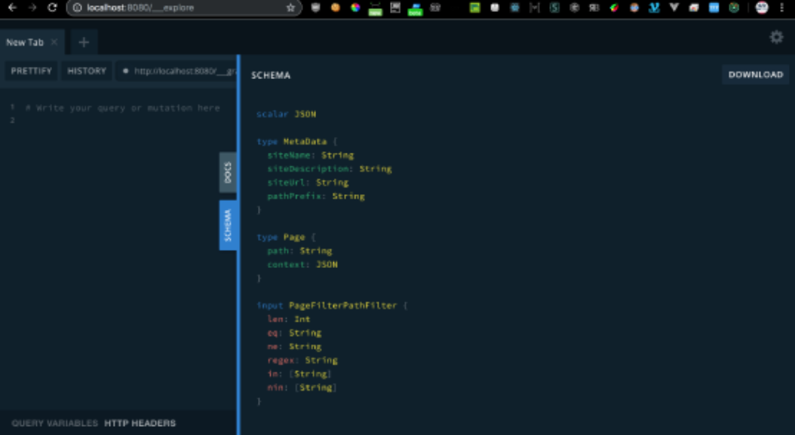
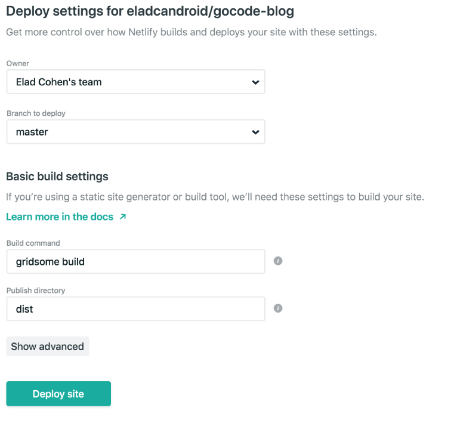

  

פעם, כדי ליצור בלוג אישי, הייתם צריכים מערכת כבדה כמו וורדפרס שכוללת ניהול משתמשים, המון ספריות וקבצים שאין לכם מושג איך לקרוא אותם.
היום בעזרת פריימוורקים כדוגמת ריאקט ו- Vue.js, הרבה דברים הפכו להיות פשוטים וקלים.

  

אם תהיתם לעצמכם - ״למה הוא מנסה לעבוד עלינו?״ אז האמת היא שאתם די צודקים... 😎

בפריימוורקים לא תוכלו באמת לכתוב בלוג בצורה פשוטה בלי שתצטרכו כל פעם לגעת בקוד ו״ללכלך את הידיים״.

  

פה נכנסו לעזרתנו ״מחוללי אתרים סטטיים״ כדוגמת **Gatsby** ו- **GridSome**.

מה שעושים שני הכלים שמעלי, Gatsby לריאקט ו GridSome ל Vue.js, זה לתת לכם מעטפת קוד מינימלית רק לשם הצגת תכנים סטטיים שתרצו לחבר אליה. התכנים יכולים להלקח מקבצי Mardown או אפילו מוורדפרס... בנוסף, תקבלו רנדור בצד שרת (Server Side Rendering) שיבנה עבורכם את קבצי ה HTML מתוך התכנים שלכם.

אז קדימה, בואו נתחיל...

# GridSome

כמובן שאני יוצא מנקודת הנחה שמותקן לכם [Node.js](https://nodejs.org/en/) בגרסא עדכנית. אם לא - תעמדו בפינה או שפשוט תתקינו מהר לפני שאראה! 👻


כדי ליצור פרויקט חדש, כתבו בטרמינל את הפקודה הבאה:
```bash
npx gridsome create my-gridsome-site
```

אחר כך נכנס לספרייה ונריץ שרת פיתוח
```bash
cd my-gridsome-site
gridsome develop
```

השרת ירוץ כברירת מחדל ב localhost:8080 בהנחה שהפורט אצלכם לא תפוס

## יצירת דפים

כל קובץ vue שתצרו תחת ספריית pages יתווסף אוטומטית כנתיב (Route) לבלוג. הרעיון כאן הוא לפשט כמה שיותר את עניין הניתובים. כמובן שאם תרצו לעשות משהו טיפה יותר מורכב תצטרכו לחפור מעט בתיעוד כאן.

## ארכיטקטורה

טוב אז הגיע הזמן להכנס קצת לעומק.. איך מסודר כל העסק הזה? הנה המבנה שזה עתה יצרנו:


אני אדבר כמו מדריך טיולים ברשותכם... 

מצד שמאל של התמונה אפשר לראות את מקורות המידע שלנו - אם זה CMS כדוגמת וורדפרס או מערכות אחרות הקרויות Headless CMS שיותר מתמקדות בהעברת מידע בעזרת API ופחות בנראות של האתר עצמו.

בין מקורות המידע אפשר למצוא גם Markdown, JSON, CSV ואפילו APIs ישירים של מונגו ומערכות נוספות

מה שנבחר כשפת Query לקשר בין כל מערכות המידע לדפים שלכם הוא GraphQL שבא לתאר את מבנה המידע המועבר.. לדוגמא עבור דף הבית המרכז את כל הפוסטים נוכל לכתוב את הקוד הבא:

```javascript
<page-query>
query Post ($path: String!) {
  post: post (path: $path) {
    title
    path
    date (format: "D/MM/YYYY")
    timeToRead
    tags {
      id
      title
      path
    }
    description
    content
    image (width: 860, blur: 10)
  }
}
</page-query>
```

שימו לב שזהו בלוק מיוחד בתוך קובץ vue שמגדיר את שאילתת ה GraphQL כדי להשתמש במידע המועבר באמצעות שאילתת GraphQL,
דף index.vue כולו, יראה כך:

```javascript
<template>
  <Layout :show-logo="false">
    <!-- Author intro -->
    <Author :show-title="true" />

    <!-- List posts -->
    <div class="posts">
      <PostCard v-for="edge in $page.posts.edges" :key="edge.node.id" :post="edge.node"/>
    </div>

  </Layout>
</template>

<page-query>
{
  posts: allPost(filter: { published: { eq: true }}) {
    edges {
      node {
        id
        title
        path
        tags {
          id
          title
          path
        }
        date (format: "D/MM/YYYY")
        timeToRead
        description
        image (width: 770, height: 380, blur: 10)
        ...on Post {
            id
            title
            path
        }
      }
    }
  }
}
</page-query>

<script>
import Author from '~/components/Author.vue'
import PostCard from '~/components/PostCard.vue'

export default {
  components: {
    Author,
    PostCard
  },
  metaInfo: {
    title: 'GoCode Blog - גו-קוד בלוג - קוד, קוד ועוד קצת קוד'
  }
}
</script>
```

התוצאה מהשאילתה תכנס למשתנה מיוחד בשם ```page$``` בו נוכל להשתמש בטמפלייט או בסקריפט.

עוד הסבר על שימוש ב GraphQL ניתן למצוא כאן:
https://gridsome.org/docs/querying-data/#how-to-query-with-graphql

כדי לראות את כל שאילתות ה GraphQL המוגדרות בפרויקט ואף להריץ אותן הפעילו
```bash
npm run explore
```

ותקבלו גינת משחקים מקסימה שנראית בערך כך:



למי שלא מכיר GraphQL - מדובר בגדול בשפת שאילתות מבית פייסבוק שכתובה בצורה דומה לאובייקט JSON ומאפשרת לנו להגדיר שליפה מרובת שדות ומקוננת ובקריאת POST אחת ניתן לתאר מה בדיוק אנחנו רוצים מהשרת. אבל זה בהחלט משפט כללי מדי אז כדאי שפשוט תתחילו להעמיק בעניין...


## בנייה לפרודקשיין והעלאה ל Netlify

אם נחזור לארכיטקטורה שראינו למעלה - כשנריץ build נקבל דפי html מרונדרים ומוכנים על מנת לא לפגוע ב SEO של האתר שלנו (בניגוד ל SPA סטנדרטי שמכיל דף אחד עם מעבר נתיבים פנימי).

```bash
gridsome build
```

הפקודה הנ״ל תבנה עבורכם גרסא מכווצת ומוקטנת שתשב בספריית dist. תוכלו להעלות אותה לכל שרת סטטי כמו Github Pages או Netlify.

כדי לבדוק שהכל בסדר אפשר להריץ  Live Server על הקבצים:

```bash
npx live-server ./dist
```

לפני שנעלה ל Netlify, נוסיף תמיכה ב Git בפרויקט ונדחוף את הקבצים ל GitHub.
אם אתם עדיין לא מבינים מה זה GIT אז פויה! 

או במילים אחרות:

[](https://www.youtube.com/watch?v=wB2c2EI3fPQ)

טוב, בחזרה ל Netlify - הרשמו לאתר וכנסו ל Dashboard שלכם.
לחצו על "New site from GIT", התחברו לגיטהאב/ביטבאקט/גיטלאב ולחצו על הרפוזיטורי המתאים

נשאר לכם להגדיר שתי הגדרות קטנות:

תחת Build Command הכניסו:

```bash
gridsome build
```

וב Publish Directory:

```bash
dist
```

את ההיגיון בטח כבר הבנתם. הנה תמונת מסך



מה? זהו?!
לגמרי! מבטיח עם ב׳!! 🤗

ומה יקרה אם ארצה לשנות משהו?
שמירה, commit, push ו Netlify יזהה ויפעיל מחדש build!
תוכלו לצפות בקסם הזה תחת Production deploys תחת האתר שלכם ב Netlify.

## כבר נגמר?

כן. ספרו לי בקבוצת הפייסבוק איך היה
https://www.facebook.com/groups/614192685738261/

## רגע, אבל מה עם Gatsby?

[Gatsby.js](https://www.gatsbyjs.org) הוא ממש ממש דומה ל GridSome... איך זה יכול להיות? מכיוון ש GridSome הוא העתק נפלא של Gatsby רק עבור Vue.js.. אבל אם תעדיפו ריאקט פשוט נסו לשחק גם איתו
[Gatsby.js](https://www.gatsbyjs.org) הוא ממש ממש דומה ל GridSome... איך זה יכול להיות? מכיוון ש GridSome הוא העתק נפלא של Gatsby רק עבור Vue.js. אבל אם תעדיפו ריאקט פשוט נסו לשחק גם איתו.


בילוג נפלא לכולם!
